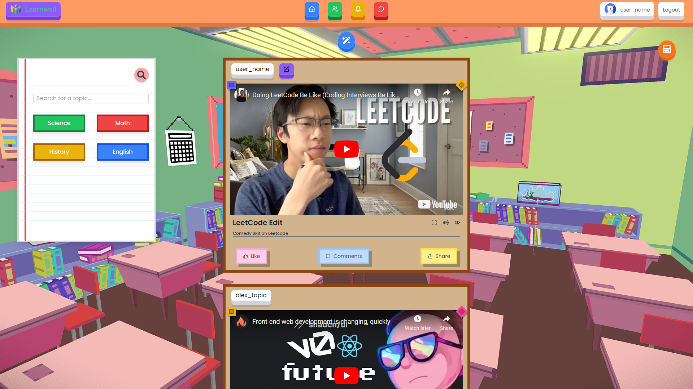
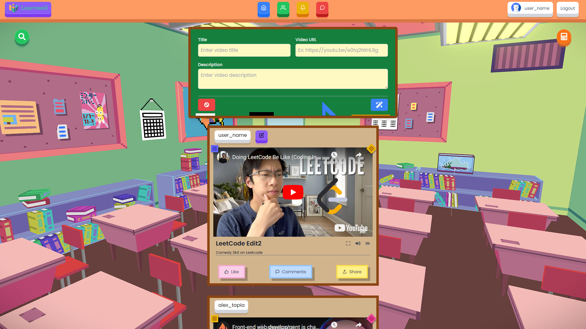
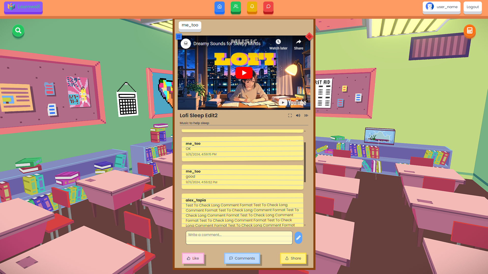
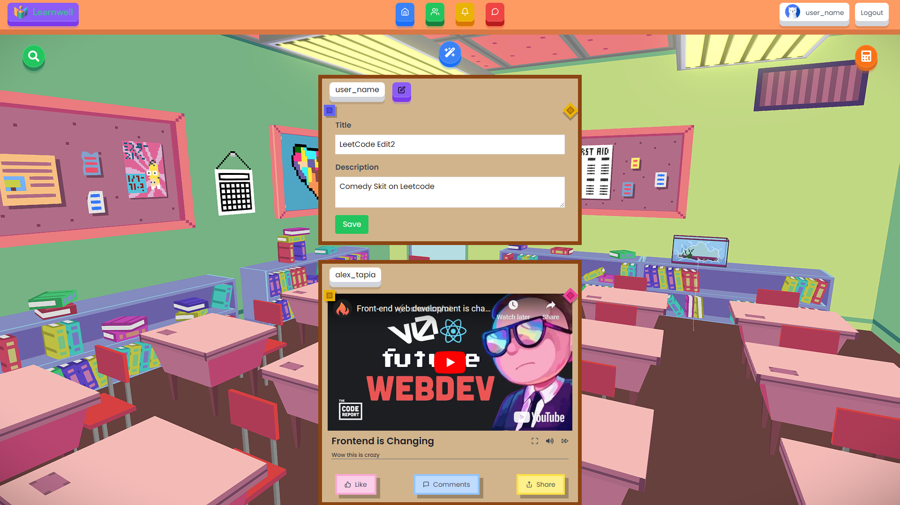
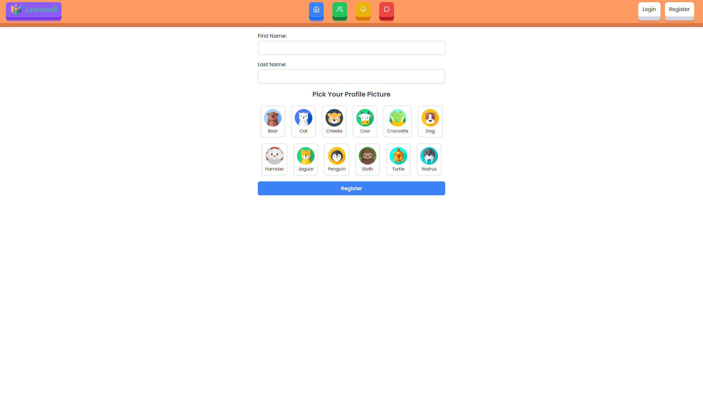
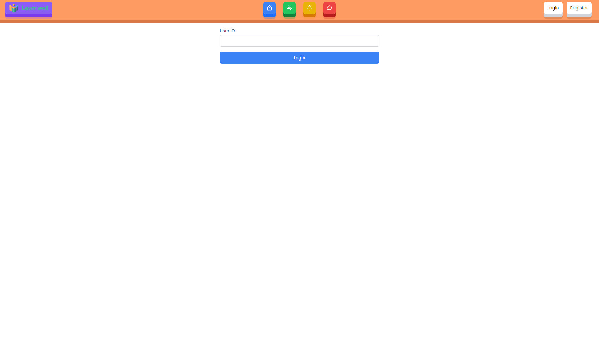

# Social-App Overview

This project features a fully functional social media app focused on video posts!

## Features

- Video feed
- Simple user login and register
- Post and Edit videos posts using video URLs
- Like posts
- Comment on posts
- View all comments on a post
- Full screen functionality with controls
- Search Utility and Calculator

## Design


### UI
  - Create video form resembles a chalkboard
  - Video Posts resemble coark boards
  - Comments appear like sticky notes, slightly skewed for character and style
  - Notebook paper as the search feature of the application
  - Calculator tool available

### Problem Solving
- Only the user who posted the video can alter / edit the video
- ReactPlayer used to display and utilize video information
- Video Feed tabination to improve loading
- Education design features user and child friendly UI, 3D and simplistic
- Zustand to manage auth, comments, and video info
- Reusable components and readable styling using tailwind merge, variants, interfaces, etc.

# Installation and Set up

### Frontend

```bash
cd frontend / && npm i
cd frontend / && npm run dev
```

### Backend

```bash
cd backend / && pip install -r requirements.txt
uvicorn backend.main:app --reload
```

# Screenshots









# Walk-through
- You will be automatically logged in as "user_name" (a choice I made to skip past the login section if desired)
- Log out of the profile to reach the register page
- Input a first name, last name, and choose an Icon to represent your profile
- A username will be created to you (first_last + number). If a previous user has the same information for their profile, a number will be appended to your username to make it unique
- After registering, you will be logged in and redirected to the video feed
- Press on the Wand icon in the center top of your screen to post a video
- To edit your video, click the purple edit button next to your post
- To view or post comments, open the comments button of any post